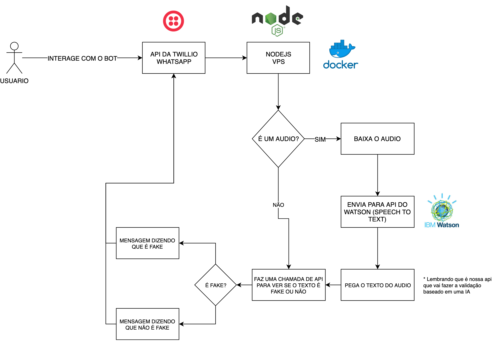

## Sherlock - Fake News ChatBot

### Hackathon Online Shawee - Hack for Good

---

## Como funciona?

O projeto utiliza as seguintes tecnologias:

  + Docker
  + Nodejs 
  + WatsonAPI
  + Lib **Natural** para treinar modelos para classificar fake news
  + Repositório com diversas noticias fakes e noticias verdadeiras para treinar nosso modelo

Repositorio com noticias falsas e verdadeiras para treinar o modelo.

https://github.com/roneysco/Fake.br-Corpus

## Arquitetura

## Passo a passo

Ao implementar no ambiente de produção, temos 2 pastas na raiz de nosso projeto.

### Chatbot

Escrito em nodejs, temos a API utilizando Express para coletar as informações que vão vir da Twillio.
Quando o usuario enviar uma mensagem pelo bot do whatsapp, esse payload será enviado para nossa API.

Feito isso, ele faz uma verificação para checar se o conteudo enviado pelo usuário é um Áudio, caso a condição seja aceita, enviamos os dados para o Watson converter o Audio em Texto e trabalhar com ele.

**IMPORTANTE**: Colocar dentro da pasta do projeto `chatbot` um arquivo chamado `.env` com todos os parametros necessários para fazer funcionar.

### Fake Detector

Nele é onde fica nossa IA capaz de analisar os textos e dizer se é fake ou não baseado em diversas noticias falsas e verdadeiras.

Repositorio:

https://github.com/roneysco/Fake.br-Corpus

**IMPORTANTE**: Clonar esse repositório dentro da pasta `fake-detector` 

Feito isso, basta acessar a rota `/treinar` para que o modelo seja treinado baseado nesses dados.

### Docker Compose

Para facilitar o deploy em diversos ambientes, a tecnologia do docker nos permite subir todo o ambiente com apenas um comando

`docker-compose up -d` 

### Progresso

  + [x] Converter o audio em texto
  + [x] Treinar modelo com base nas noticias falsas
  + [x] Chamar API para validar os textos
  + [x] Mandar mensagem de volta para o usuário
  + [ ] Buscar na web para validar se existem sites dizendo que é fake
  + [ ] Fazer o download de videos, converter para audio e fazer a checagem se é fake news ou não

